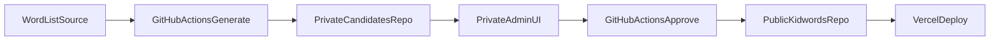

# Pipeline Overview

## Goal
Build a semi-automated pipeline that generates candidate images and definitions
for new words, supports private admin review, and publishes approved content
to the public Kidwords app.

## Key Constraints
- Candidate data must stay private (not in public repo or bundled into public UI).
- Admin review is gated by basic auth.
- Batch generation and publishing are handled by GitHub Actions.

## High-Level Flow
1. A batch of new words is submitted on a cadence (daily).
2. GitHub Actions generates image candidates (Gemini) and definition candidates
   (Claude/ChatGPT) for all levels.
3. Candidates are stored in a private GitHub repo/branch.
4. Admin reviews candidates in a private UI, selects the best image/definition,
   and can add sub-prompts to request better results.
5. Approved content is published to the public Kidwords repo and deployed via Vercel.

## Non-Goals (for this phase)
- Public user authentication.
- Paid admin workflows.
- Moderation by multiple roles or teams.

## Acceptance Criteria
- A daily job can accept a list of words and generate candidates.
- Candidates are not visible in the public site or public repo.
- Admin can review, select, and request regeneration.
- Approved content updates the public Kidwords app and deploys.

